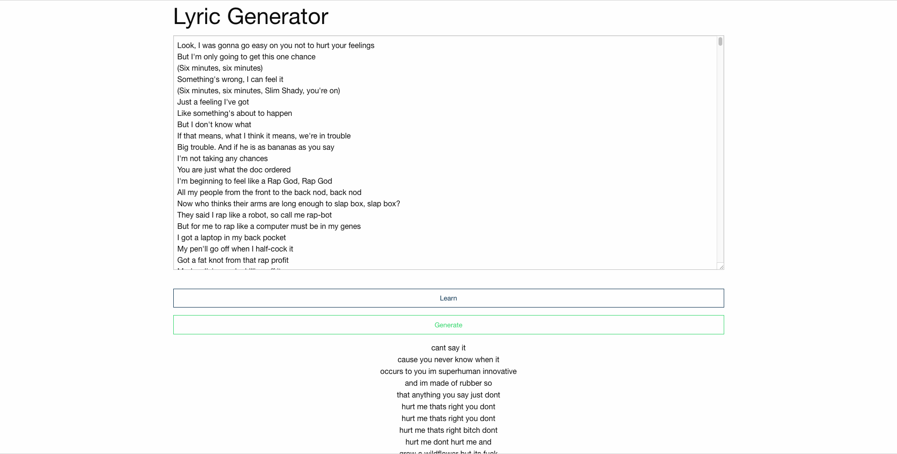

# Naive Lyrics Generator
A naive lyrics generator that learns from input lyrics to generate new lyrics with the same words. *Work in Progress*

Built with a Markov Chain implemented in Javascript.
It sometimes doesn't make sense. :smile:

## Instructions
1. Paste some lyrics in the text box.
2. Press the **Learn** button. Wait to finish.
3. Press **Generate** to get new lyrics.